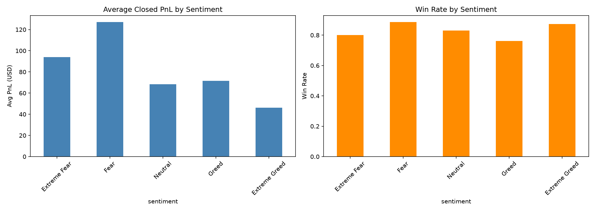
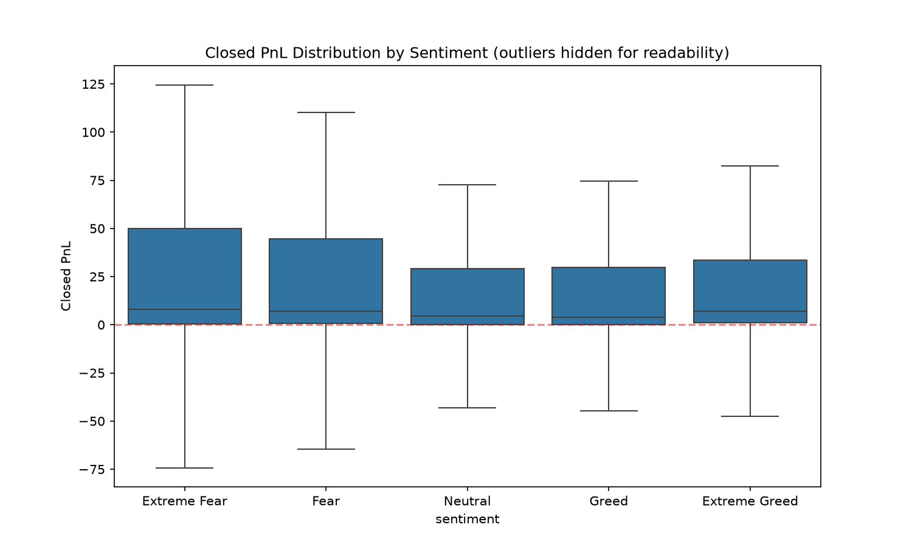
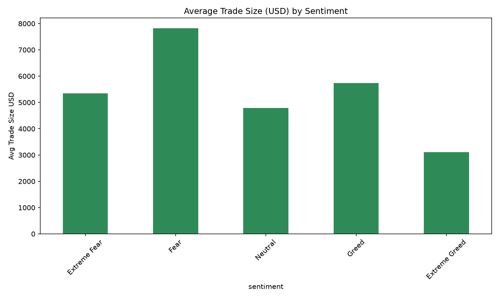

# Crypto Sentiment & Trader Performance Analysis

Exploring the relationship between Bitcoin market sentiment (Fear/Greed Index) and trader performance on Hyperliquid, using historical trade-level data.

## Objective

Analyze whether trader performance (PnL, win rate) and trading behavior (frequency, position size) vary systematically with market sentiment, and derive insights that could inform smarter trading strategies.

## Data

| Dataset | Rows | Columns | Source |
|---|---|---|---|
| `data/fear_greed_index.csv` | 2,644 | `timestamp, value, classification, date` | Bitcoin Fear & Greed Index |
| `data/historical_data.csv` | 211,224 | `Account, Coin, Execution Price, Size Tokens, Size USD, Side, Timestamp IST, Start Position, Direction, Closed PnL, Transaction Hash, Order ID, Crossed, Fee, Trade ID, Timestamp` | Hyperliquid historical trades |

Trades span **2023-05-01 to 2025-05-01** (480 unique trading days) across **32 unique accounts** and **246 coins**.

## Repository Structure

```
├── data/
│   ├── fear_greed_index.csv
│   ├── historical_data.csv
│   └── processed/              # generated locally by notebook 01, not committed (see .gitignore)
├── notebooks/
│   └── 01_data_exploration.ipynb   # full analysis pipeline
├── outputs/
│   └── figures/                 # saved chart PNGs
├── reports/
│   └── findings_report.md       # full write-up: methodology, findings, recommendations
├── requirements.txt
└── README.md
```

## How to Reproduce

```bash
git clone https://github.com/Tony-techno/crypto-sentiment-trader-performance.git
cd crypto-sentiment-trader-performance
python -m venv venv
venv\Scripts\activate          # Windows
pip install -r requirements.txt
```
Open `notebooks/01_data_exploration.ipynb` in VS Code / Jupyter, select the `venv` kernel, and run all cells top to bottom. This regenerates `data/processed/merged_trades_sentiment.csv` and all figures in `outputs/figures/`.

## Methodology (Summary)

1. Loaded and validated both datasets (shape, dtypes, nulls, duplicates).
2. Parsed trade timestamps and merged sentiment onto trades by calendar date (left join, 6 unmatched rows dropped — negligible).
3. Classified trades as opening vs closing (`Direction` column) since realized PnL is only meaningful on closes.
4. Aggregated performance (PnL, win rate) and behavior (trade frequency, size) by sentiment category.
5. Validated the aggregate pattern with a Kruskal-Wallis test and a per-account breakdown to check for concentration/robustness.

Full detail in [`reports/findings_report.md`](reports/findings_report.md).

## Key Findings

1. **Aggregate PnL and win rate are highest during Fear and lowest during Greed** (statistically significant, Kruskal-Wallis p < 0.001).
2. **This pattern is not universal at the individual-trader level** — only 45% of accounts (14/31) actually perform better in Fear than Greed. The top 5 accounts generate 62.6% of total platform PnL, meaning the aggregate result is disproportionately shaped by a small number of large traders.
3. **Average trade size is highest during Fear** ($7,816 vs $3,112–$5,737 in other regimes), so part of the higher absolute PnL reflects larger position sizing, not purely better win rates.
4. **Extreme Fear activity is event-driven and low-sample** (only 14 trading days, with 2 days accounting for ~34% of its trade volume) — its metrics should be treated as anecdotal rather than a stable trend.





## Tech Stack

Python, pandas, NumPy, matplotlib, seaborn, SciPy (statistical testing), Jupyter.

## Author

Anvesh — [GitHub](https://github.com/Tony-techno)
